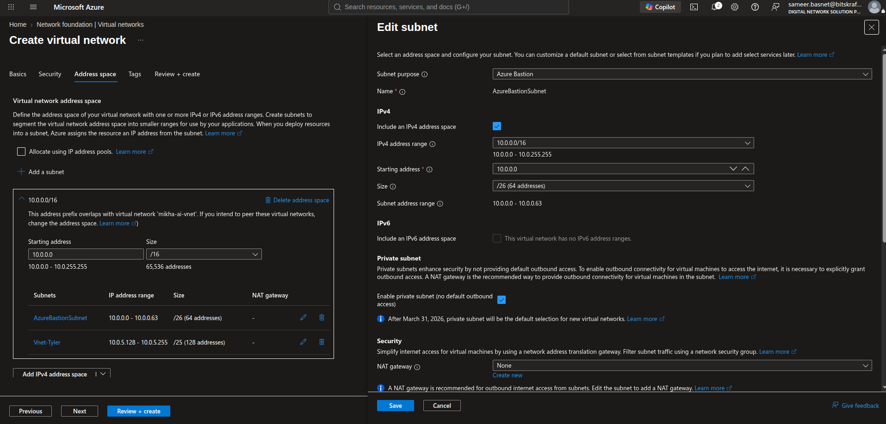
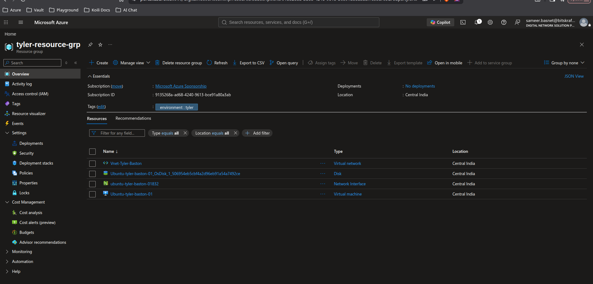
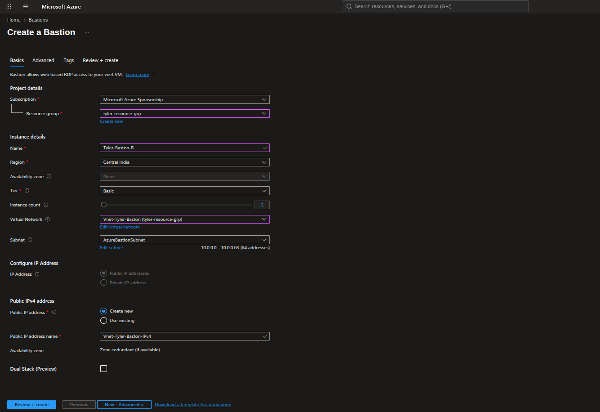
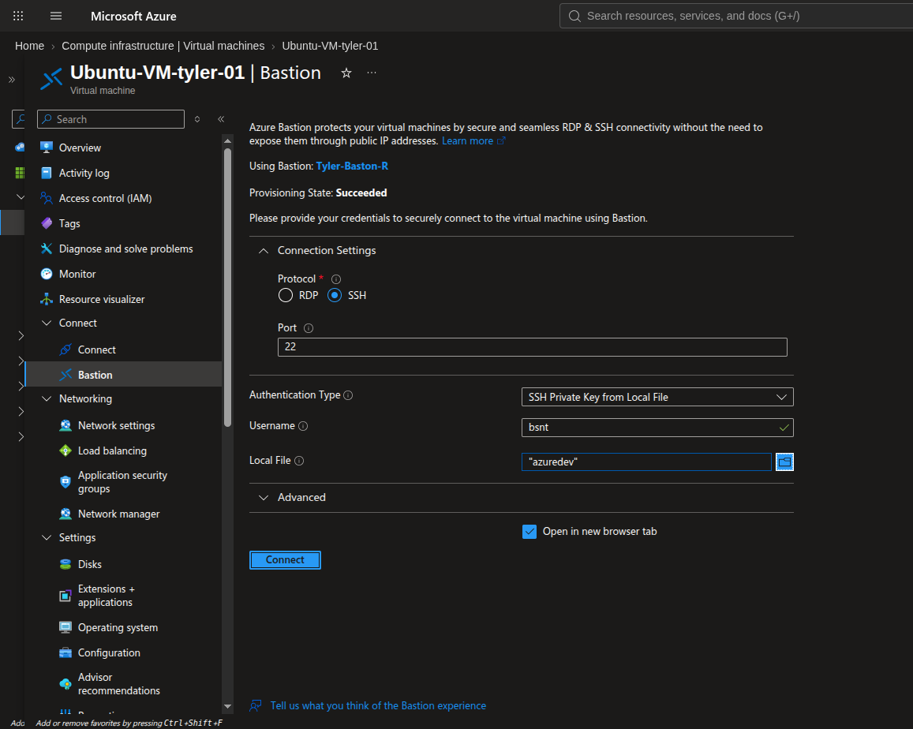
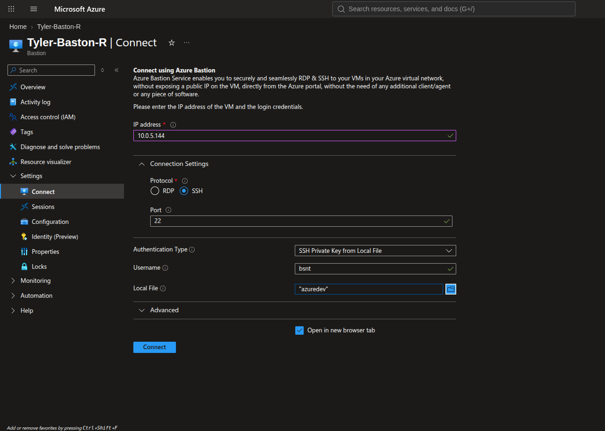
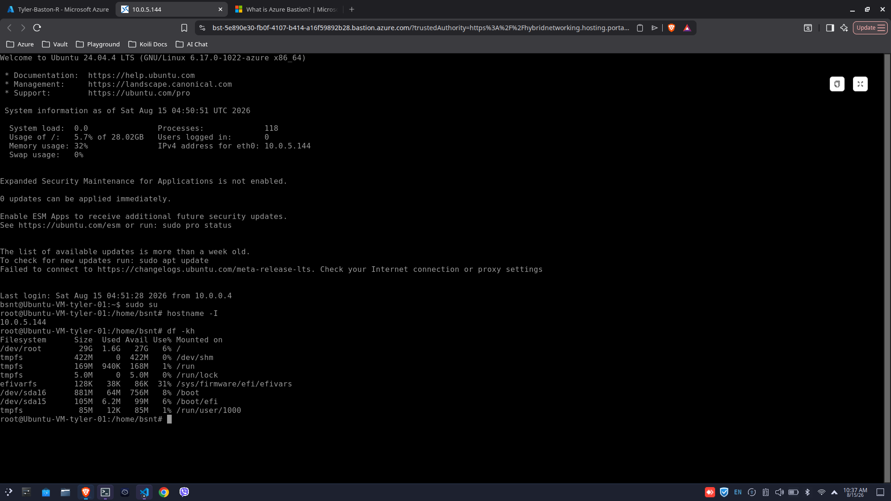

#### **Step 1: Create the Virtual Network and Subnets**

Azure Bastion requires a dedicated subnet with a very specific name to function.

1. Go to the Azure Portal and create a **Virtual Network (VNet)** (e.g., `Vnet-Tyler-Baston`).
2. Define your IP address space (e.g., `10.0.0.0/16`).
3. **CRITICAL:** Create a subnet and name it exactly **`AzureBastionSubnet`**.

- _Rule:_ The size must be at least **/26** or larger (e.g., `10.0.2.0/26`). If you spell it differently, the deployment will fail.

4. Create your primary subnet for your VMs (e.g., `subnet-pool-1` with `10.0.1.0/24`).

#### **Step 2: Deploy the VM with No Public IP**

1. Navigate to **Virtual Machines** and click **Create**.
2. Select the VNet you just created (`Vnet-Tyler-Baston`) and attach it to the `subnet-pool-1`.
3. Choose your OS (Windows or Linux).
4. Under the **Networking** tab, look for **Public IP** and explicitly set it to **None**.
5. Finish creating the VM.

#### **Step 3: Deploy Azure Bastion**

1. Search for **Bastions** in the top search bar and click **Create**.
2. Name your Bastion host (e.g., `Tyler-Baston-R`).
3. Select the region matching your VNet.
4. For the **Virtual network**, select `Vnet-Tyler-Baston`. It will automatically detect your `AzureBastionSubnet`.
5. Under **Public IP address**, click **Create new** (Bastion requires a Public IP for _itself_ so you can reach it from the portal, but it will never expose this IP directly to your VMs).
6. Click **Review + Create**. _(Note: Provisioning Bastion usually takes about 5 to 10 minutes)._

#### **Step 4: Connect via Bastion using the Native Portal Experience**

1. Once Bastion is deployed, navigate back to your Virtual Machine in the Azure Portal.
2. At the top of the VM's Overview page, click **Connect**, then select **Bastion** from the drop-down menu.
3. Enter the local administrator username and password (or SSH key) you created when you built the VM.
4. Click **Connect**.
   
5. A new browser tab will instantly open, giving you a smooth, HTML5-based RDP or SSH session right inside your web browser.

 6. Also, we cannot connect via Baston Resource using IP as we enabled Ip connections.

#### **Step 5: Confirm the Private Connection**

Once you are inside the VM via the browser session:

- If you deployed Windows: Open CMD and type `ipconfig`.
- If you deployed Linux: Open the terminal and type `ifconfig` or `ip a`.
  
- You will see that the machine only has its `10.0.1.x` private IP address. Because it has no Public IP, it is entirely invisible to the internet, but you are still securely administrating it via Azure Bastion!
